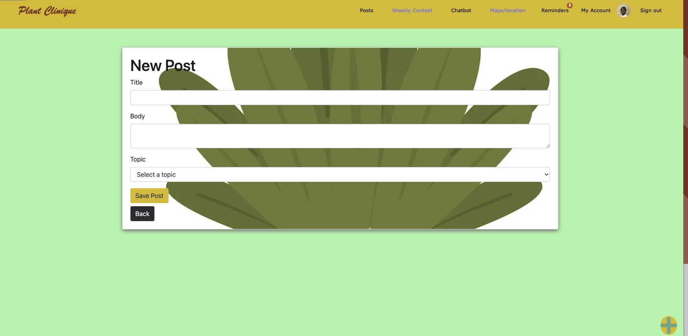
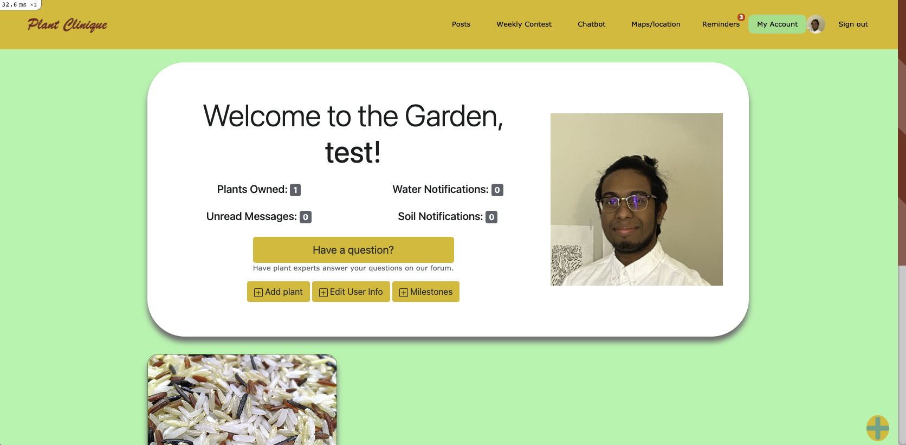
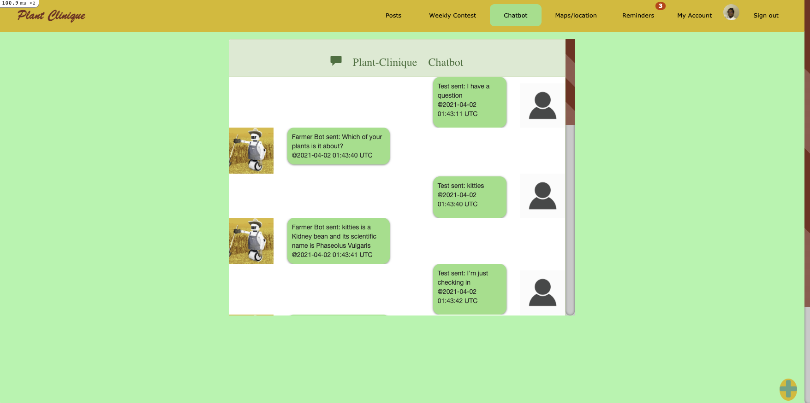
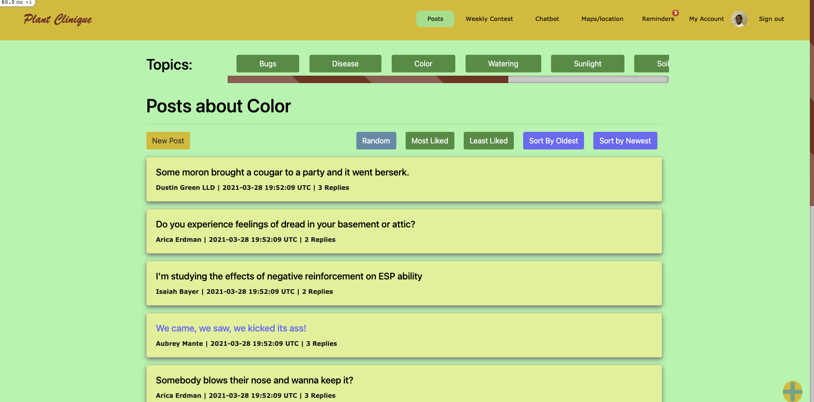

# Plant-Clinique - Introduction

Repo for us to make and track Plant Clinique features

# URL patterns

- Homepage: `/`
  - redirects to ~> GET `/users/:id` if signed in
  - redirects to ~> GET `/sign_in` if signed out
- Account
  - Sign in: GET `/sign_in`
  - Forgot password: 
    - GET `/passwords/new`
    - POST `/passwords`
  - Sign up: GET `/sign_up`
  - Create new user:
    - POST `/users`
    - POST `/passwords`
  - Sign out: DELETE `/sign_out`
- User management
  - User page: GET `/users/:id`
  - Edit user info: 
      - GET `/users/:id/edit` 
      - PATCH PUT `/users/:id`
  - Edit password: 
      - GET `/users/:user_id/password/edit`
      - PATCH PUT `/users/:user_id/password`
  - Delete user info: DELETE `/users/:id`
- User Plant
  - All plants: GET `/users/:id`
  - Add plant: 
    - GET `/user_plants/new`
    - POST `/user_plants`
  - Edit plant info: 
    - GET `/user_plants/:id/edit`
    - PATCH PUT `/user_plants/:id`
  - Delete plant: (in user page) DELETE `/user_plants/:id`
- Post
  - All posts: GET `/posts`
  - Edit post: 
    - GET `/posts/:id/edit`
    - PATCH PUT `/posts/:id`
  - Delete post: DELETE `/posts/:id`
  - Get posts of a specific topic: GET `/posts/search={topic_enum}&commit={topic}`
  - Read a post: GET `/posts/:id`
  - Add a new post:
    - GET `/posts/new`
    - POST `/posts/`
  - Add a reply: POST `/posts/:post_id/replies`
  - View replies (on a post): GET `/posts/:post_id/replies`
- Chatbot:
  - Visit the chatbot: GET `/chatbot_messages`
  - Send a message to the chatbot: POST `/chatbot_messages`
- Reminder (work in progress)

## Constraints

- SignedIn: get root to "users#current_user_dashboard"
- SignedOut: get root to "/sign_in" to clearance/session#new

# DB Schema

(🌱: primary key; <ins>underlined</ins>: foreign key)

## Schema

- <strong>User</strong>
  - user_id: integer 🌱
  - username: string
  - email: string
  - encrypted_password: string
  - confirmation_token: string
  - remember_token: string
  - admin: boolean
- <strong>UserPlant</strong>
  - plant_id: integer 🌱
  - <ins>user_id: integer</ins>
  - name: string
  - age: float
  - plant_type: string
  - image_url: string
  - description: string
- <strong>Reminder</strong>
  - reminder_id: integer 🌱
  - <ins>user_plant_id: integer</ins>
  - <ins>user_id: integer</ins>
  - reminder_time: datetime
  - description: string
  - reminder_type: enum
- <strong>ChatbotMessage</strong>
  - chatbot_message_id: integer 🌱
  - <ins>user_id: integer</ins>
  - time_sent: datetime
  - from_bot: boolean
  - content: string
- <strong>Post</strong>
  - post_id: integer 🌱
  - <ins>user_id: integer</ins>
  - topic: enum
  - title: string
  - body: string
- <strong>Reply</strong>
  - reply_id: integer 🌱
  - <ins>user_id: integer</ins>
  - <ins>post_id: integer</ins>
  - body: string
- <strong>PlantType</strong>
  - plant_type_id: integer 🌱
  - name: string

## DB Associations

# App views

- Login/Sign Up/Logout: The Login is basic with a place for your email and password. The sign up has a space for your username, email, and password. The Logout takes you back to the log in page. These pages were customized to have a simple design that includes our logo.

- My Account: This page will welcome you to the app, show you any plant related notifications you have, and more. If you have a question you can easily access the public forum, edit your own account info, and add a plant to your "garden". Your garden will be a collection of the plants you own, visually indicated below your user information. These plant cards can be edited, removed, and play a role in the chatbot feature.

- Chatbot: The chatbot uses a multiple choice questionnaire to ascertain information for the user. The chatbot is displayed on a single page that resembles facebook messanger, where incoming messages from the bot are on the left. After the bot responds to the user it displays optional replies using bootsrap buttons. There is also a plus sign on all pages (when logged in) in the bottom right corner for an instant jump to the chatbot.

- Posts: This page is robust because posts can be filed by a different enum topic, and because a post can have many replies. The URL patterns above demonstrate the many functionalities, but this is our basic forum. Currently we have used data from the Faker gem to populate posts (Faker::Movies::Ghostbusters.quote). Posts and comments you submit are editable.

- application.html.erb (header, footer, scrollbar): This is the code where we implemented the navbar, the footer, and the scroll bar. The scroll bar was implemented using CSS. The footer was implemented using bootsrap and includes links to helpful areas. The bootsrap navbar helps the user with accessibility and has links to all the pages of our app, including the login and logout.

- What's next
  - Reminders/Notifications: This will be implemented both in the navbar and the user page, as a badge indicating the number of notifications. The reminder page's functionalily will be based around the URL patterns outlined above. There will also be a clock on right with a calendar date so that the user knows what time they are putting into their reminder. We will also use a gem to email you if a reminder has been pending for a day.
  - Maps: This page will show you a local view of the area around you, marking parks, hiking locations, etc with a tree icon and a dollar icon over stores that sell/deal with plants.
  - Weekly Contest: a 7 day period where different plants are admitted to a contest and verified users vote on best plant that week (will remain up until new plant voted on)

# Dependencies (APIs, Gem, Libraries)

(🌟: particularly interesting)

## APIs

- [Trefle](https://trefle.io/) 🌟: Currently used in the [chatbot](https://github.com/Plant-Clinique/Plant-Clinique/blob/9871876d25563ac6196ea39ce81cd14a7a9c5777/app/helpers/chatbot_messages_helper.rb#L13-L14) to get information about plants based on plant type, including sunlight, water, temperature, and many more. It has an exhaustive list of plants sourced from USDA, Wikimedia, and more. 
- [OpenWeather](https://openweathermap.org/api): Planning to use this for fetching weather at the current user's location so that we can estimate temperatures and better understand what plants the user can grow at home.
- [Ambee Soil](https://www.getambee.com/api/soil): Planning to use this for fetching soil information to better estimate what plants the user can grow at home.

## Gems
- [Clearance](https://github.com/thoughtbot/clearance) 🌟: Currently used for authenticating/authorizing users and things like remembering them and validating their login/signup data. We're working on finalizing the forgot-password feature using this gem, as well. 
- [binding_of_caller](https://github.com/banister/binding_of_caller): Currently used in development to aid in debugging. It allows us to evaluate code to check the state of our objects whenever we hit an error directly in the browser.
- [rubocop](https://github.com/rubocop/rubocop): Currently used for our backend team to check code style. We also have it set up in a GitHub workflow action ([check here](https://github.com/Plant-Clinique/Plant-Clinique/blob/473db669e95584defb644bd3e156ca7bab2a36cc/.github/workflows/rails.yml#L50)) to easily see what the linter thinks about the code in the pull request (e.g. [see how it evaluated for this PR](https://github.com/Plant-Clinique/Plant-Clinique/runs/2108178436?check_suite_focus=true)).
- [Kaminari](https://github.com/kaminari/kaminari) 🌟: Currently used for paginating the posts page every 7 posts. We didn't like how we had to scroll way down to see all posts because then we would have to scroll all the way back to get to the topics pills; this solved the problem.
- [RSpec](https://github.com/rspec/rspec-rails) 🌟: Currently used for [integration tests](https://github.com/Plant-Clinique/Plant-Clinique/tree/main/spec/features), which as you can see in that link we've done for Clearance (signing in, signing up, and signing out), and RailsAdmin (visitor is admin, visitor is not admin).
- [rails-controller-testing](https://github.com/rails/rails-controller-testing): Currently used in our in progress [user plants integration tests](https://github.com/Plant-Clinique/Plant-Clinique/blob/main/spec/requests/user_plants_spec.rb#L46) to check that the correct template is getting rendered on GET request to edit a user's plant.
- [factory_bot_rails](https://github.com/thoughtbot/factory_bot_rails): Currently used in our [integration tests](https://github.com/Plant-Clinique/Plant-Clinique/tree/main/spec/features) to generate users for Clearance and RailsAdmin integration testing (similar to what Rails' native fixtures do).
- [active_record-events](https://github.com/pienkowb/active_record-events) 🌟: Currently used for adding an editted tag to posts that have been edited. It also allows us to keep track of the exact time a post was edited. We plan to use this for replies as well.
- [Wicked](https://github.com/zombocom/wicked): Planning to use this in the chatbot so that it can ask more types of questions without bloating the code. This is currently in progress ([here is the PR](https://github.com/Plant-Clinique/Plant-Clinique/pull/44)).
- [Select2](https://github.com/argerim/select2-rails): Planning to use this to integrate jQuery Select2 plugin that allows users to search in a selectbox. This would be very useful for searching plant types when making or updating a user plant. 
- [Noticed](https://github.com/excid3/noticed): Planning to integrate this with our Twilio powered reminders that are currently in progress as well.

## More
- [Heroku Scheduler](https://devcenter.heroku.com/articles/scheduler): Planning to use this to help us with sending reminders to users. 
- [Twilio](https://www.twilio.com/blog/2017/12/send-sms-ruby-rails-5-coffee.html): Planning to use this to send the reminders to users through sms.